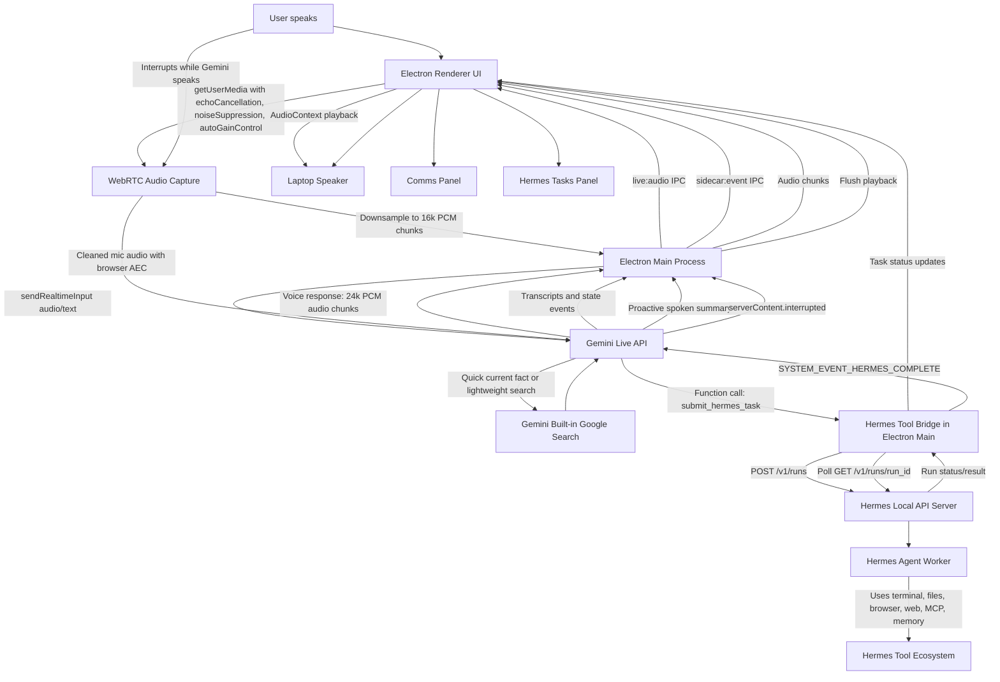

# Iris Hermes Voice

A desktop voice companion that uses **Gemini Live** for natural realtime conversation and **Hermes Agent** for long-running work.

The app is designed as a voice-first front-end: you speak naturally, Gemini Live responds in realtime, and when the request needs tools or autonomous work, Gemini hands it to Hermes in the background.

## What This App Does

- Captures your microphone through Electron/Chromium with WebRTC audio cleanup.
- Streams cleaned audio to Gemini Live as 16 kHz PCM.
- Plays Gemini Live audio responses through the app using browser `AudioContext`.
- Lets Gemini use built-in Google Search for quick current facts.
- Lets Gemini hand serious work to Hermes through the Hermes local API server.
- Shows conversation in the Comms panel and Hermes jobs in the Hermes Tasks panel.
- Proactively announces Hermes results when a background task finishes.
- Supports interruption/barge-in: when you speak over Gemini, playback is flushed.
- Includes light/dark UI themes, an animated voice orb, and keyboard shortcuts.

## Current Architecture



## How The Flow Works

1. **You speak to the app.**

   Electron captures your microphone using Chromium's WebRTC audio path:

   ```ts
   echoCancellation: true
   noiseSuppression: true
   autoGainControl: true
   ```

   This gives the app laptop-speaker echo cancellation similar to browser/mobile voice apps.

2. **The renderer streams audio to Electron main.**

   The renderer downsamples microphone audio to 16 kHz PCM chunks and sends them over Electron IPC.

3. **Electron main streams to Gemini Live.**

   Electron main owns the Gemini Live session using `@google/genai` and sends audio via `sendRealtimeInput`.

4. **Gemini decides the route.**

   Gemini has two tool paths:

   - **Google Search** for quick current facts and simple web lookups.
   - **Hermes tools** for real work: deals, research, coding, files, terminal work, email checks, browser tasks, automation, and anything that should continue in the background.

5. **Hermes runs work in the background.**

   When Gemini calls `submit_hermes_task`, Electron main submits the task to Hermes using:

   ```text
   POST /v1/runs
   ```

   Hermes returns a `run_id` immediately, so Gemini can keep talking instead of waiting.

6. **The app tracks Hermes.**

   Electron polls Hermes run status and updates the Hermes Tasks panel.

7. **Hermes completion is fed back to Gemini.**

   When a run completes, Electron sends Gemini an internal message:

   ```text
   SYSTEM_EVENT_HERMES_COMPLETE
   ```

   Gemini then proactively tells you Hermes has returned, summarizes the result, and asks whether you want to go through the details before continuing.

8. **You can interrupt Gemini.**

   If you speak while Gemini is talking, Gemini sends an interruption event. The app flushes queued playback so Gemini stops talking over you.

## Main Components

### Electron Main

File: `electron/main.mjs`

Responsibilities:

- Loads `.env`.
- Creates the Gemini Live session.
- Defines Gemini tools.
- Bridges Gemini tool calls to Hermes.
- Sends/receives Gemini audio.
- Polls Hermes runs.
- Announces Hermes completion back into Gemini.

### Electron Preload

File: `electron/preload.cjs`

Responsibilities:

- Exposes safe IPC APIs to the renderer.
- Sends microphone PCM chunks to Electron main.
- Receives Gemini audio chunks and interruption events.
- Receives app state events.

### React Renderer

Files:

- `src/App.tsx`
- `src/App.css`
- `src/ReactorCore.tsx`
- `src/BootSequence.tsx`

Responsibilities:

- Renders the UI.
- Captures microphone with WebRTC audio cleanup.
- Downsamples mic audio to 16 kHz PCM.
- Plays Gemini audio through `AudioContext`.
- Shows Comms and Hermes Tasks.
- Supports light/dark theme.
- Provides keyboard shortcuts.

### Python Sidecar

Files under `sidecar/`

This was the original Gemini Live/PyAudio prototype. The current app now uses Electron-native audio for better laptop-speaker echo cancellation, but the Python sidecar remains useful as a reference and for future experiments.

## Gemini Tools

Gemini Live is configured with:

```js
tools: [
  { googleSearch: {} },
  {
    functionDeclarations: [
      check_hermes_status,
      submit_hermes_task,
      get_hermes_task_status,
      stop_hermes_task,
      approve_hermes_action,
    ]
  }
]
```

Routing behavior:

- Quick answer or current fact: **Gemini Search**.
- Multi-step work or background task: **Hermes**.
- Hermes completion: **Gemini proactively announces result**.

## Hermes Requirements

The app expects Hermes API server to be reachable at:

```text
http://127.0.0.1:8642
```

Your `~/.hermes/.env` should include:

```bash
API_SERVER_ENABLED=true
API_SERVER_KEY=iris-local-dev
```

Restart Hermes gateway after changing this:

```bash
hermes gateway restart
```

Verify:

```bash
curl -s http://127.0.0.1:8642/health
```

Expected output:

```json
{"status":"ok"}
```

## Local App Environment

The app reads `.env` in this repo.

Example:

```bash
GEMINI_API_KEY=your_google_ai_studio_key
GEMINI_LIVE_MODEL=models/gemini-3.1-flash-live-preview
GEMINI_LIVE_VOICE=Zephyr
HERMES_API_URL=http://127.0.0.1:8642
API_SERVER_KEY=iris-local-dev
HERMES_BIN=/Users/you/.local/bin/hermes
```

## Setup

Install Node dependencies:

```bash
npm install
```

Run the app:

```bash
npm run dev
```

Build/check:

```bash
npm run build
```

## Controls

- **W**: Wake
- **S**: Sleep
- Top-right Sun/Moon icon: toggle light/dark theme
- Top-right signal icon: live connection indicator

## Notes

- The app now uses Electron/Chromium microphone capture instead of Python `pyaudio` for the main Gemini Live path. This gives better echo cancellation on laptop speakers.
- Gemini Live model: `gemini-3.1-flash-live-preview`.
- Gemini 3.1 Live function calls are synchronous, so Hermes tasks return a `run_id` immediately and finish in the background.
- Hermes remains your actual worker agent for tool-heavy tasks.
