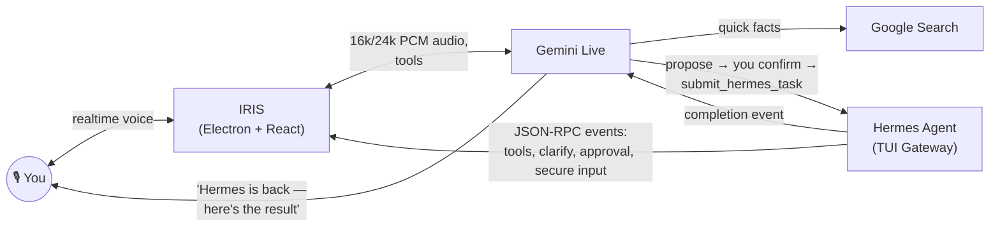

# I.R.I.S

**A JARVIS-style voice companion for your desktop.**
Talk naturally. Delegate real work. Control it with your hands. Let it float over everything you do.

[License: MIT](LICENSE)
[Platform](#-quick-start)
[Built with Electron](#-tech-stack)
[PRs Welcome](#-contributing)
[Follow on X](https://x.com/ai_for_success)

**Gemini Live** is the voice. **Hermes Agent** is the muscle. Iris is the bridge between you and both.

[Demo](#-demo) · [Features](#-features) · [Glass HUD](#-glass-hud-mode) · [Quick Start](#-quick-start) · [How It Works](#-how-it-works)


---


## 🎬 Demo

> 🔊 **Sound on — Iris is a voice tool.** A real session: waking Iris by voice, delegating a task to Hermes mid-conversation, live tool steps streaming in, opening the result hands-free with a finger point, and Glass HUD mode over the desktop.

[https://github.com/user-attachments/assets/735eb3eb-d98e-4e45-913c-66105ae076b1](https://github.com/user-attachments/assets/735eb3eb-d98e-4e45-913c-66105ae076b1)

---


## ✨ What is Iris?

Iris is a **voice-first desktop companion** built on a two-brain architecture:

- 🎙️ **Gemini Live** handles realtime conversation — you speak, it answers instantly with natural voice, handles interruptions (talk over it, it stops), and uses built-in Google Search for quick facts.
- 🛠️ **[Hermes Agent](https://github.com/NousResearch)** does the real work — research, coding, files, terminal, browser automation, email, Notion, anything tool-heavy. Iris hands tasks to Hermes **in the background** and keeps chatting with you while Hermes grinds.
- 🖐️ **MediaPipe hand tracking** lets you drive the whole UI in the air — point-and-hold to click anything, open palm to scroll, fist to close. Fully on-device.
- 🪟 **Glass HUD mode** turns Iris into a transparent, click-through overlay floating above your entire screen — keep coding, browsing, writing, while Iris hovers like a heads-up display.

When Hermes finishes a background task, Iris **proactively speaks up**: *"Quick update — Hermes is back with the result."* That's the loop: you talk, Iris routes, Hermes works, Iris reports back.

---


## 🚀 Features


### Voice & conversation

- **Realtime voice** via Gemini Live (16 kHz in / 24 kHz out, WebRTC echo cancellation — works fine on laptop speakers)
- **"Hey Iris" wake word** — local, on-device ONNX inference; nothing leaves your machine while asleep
- **Barge-in** — interrupt Iris mid-sentence and it yields immediately
- **Voice-driven UI** — "open the latest result", "show the steps", "open the failed one", "close it" — fuzzy-matched against what's on screen
- **Scoped personal context** — a small stable `USER.md` profile is present in conversation; project/episodic facts are retrieved on demand from Hermes `MEMORY.md` and the brain vault with source and freshness metadata


### The Hermes work loop

- **Background delegation** — tasks return a `run_id` instantly; conversation never blocks
- **Live activity feed** — every tool call Hermes makes (browser, code, files, search) streams into the task card in real time with durations
- **Full Hermes interaction bridge** — native clarification choices/free text, dangerous-command approvals, sudo passwords, and secret prompts surface in Iris. Sensitive values stay UI-only and never enter Gemini.
- **Visible voice answers** — spoken clarification text fills the on-screen field/choice briefly before Iris submits it to Hermes
- **Proactive completion announcements** — Iris tells you the moment work finishes and summarizes it out loud
- **System-enforced confirmation gate** — Iris *cannot* dispatch until it reads back an immutable proposal and you give a standalone yes in your own turn. Proposal ID, exact brief, selected Hermes thread, TTL, and semantic yes/no are enforced in code.
- **Anti-hallucination guardrails** — status and results can only come from real Hermes API responses; "still working" is the only honest answer until then, and tool responses say so explicitly


### Sessions & memory

- **One pinned Hermes chat thread** — like picking a chat in the Hermes app; no stray sessions
- **Session switcher on the main page** — chip at the top of the Work Stream lists your Iris sessions; **+** starts a new thread (named by Hermes, titled by your first prompt, like every chat tool)
- **Session-scoped Work Stream** — only the selected session’s cards are shown; work in other sessions continues without leaking cards into the current thread
- **History restore** — close Iris, reopen it, and your past completed runs are rebuilt from Hermes's own session transcript. Nothing is lost between launches.


### Hands-free control

- **Point-and-hold to click anything** (~0.3 s) — cards, buttons, toggles, chips; the reticle visibly "charges" while arming
- **Open palm** — joystick scrolling over whatever region your hand hovers: work stream, comms, step timelines, the reader
- **Two open palms** — resize the reader
- **Closed fist** — close the reader
- All tracking is **on-device** (MediaPipe GestureRecognizer); frames never leave your machine


### Design

- **Deep-space design system** — electric cyan + violet on near-black, glass panels, Inter / Space Grotesk / JetBrains Mono
- **The orb** — a canvas-drawn arc reactor that breathes with the actual audio level, changes palette per state (listening / speaking / working), and flashes when work is handed off
- **Orb micro-expressions** — a double-pulse on wake, a soft ripple when your words are locked in, and an orbiting "thinking" swirl in the gap before Iris speaks
- **Two voice signatures** — your voice renders as sharp radial bars around the orb; Iris's voice as a smooth breathing wave. You can *see* who's talking.
- **Sound design** — five subtle synthesized cues (wake, sleep, task sent, task done, approval needed). No audio files; pure tuned Web Audio tones. Toggle in Settings.
- **Comet handoff** — a particle streaks from the orb to the task card when Gemini delegates, and back when Hermes returns
- **Cinematic boot sequence**, animated transitions, and a custom app icon rendered from the orb itself

---


## 🪟 Glass HUD mode

The signature feature. Press **⌥H** anywhere (or say *"enter HUD mode"*):


- Iris becomes a **transparent, always-on-top overlay** across your whole screen
- **Click-through everywhere** except Iris's own elements — your mouse works normally in the apps underneath
- Collapsible **Tasks** and **Comms** chips, camera tile, caption pill by the orb
- Open results in a glass reader **without blacking out your desktop**
- Gestures get even better here: your hand reticle floats over your entire screen
- Menu-bar tray icon keeps Iris alive in the background (wake/sleep/HUD from the tray)


---


## ⚡ Quick Start


### Prerequisites

- **Node.js 20+** and npm
- **[Hermes Agent](https://github.com/NousResearch)** installed with the gateway running
- A free **Gemini API key** from [Google AI Studio](https://aistudio.google.com/apikey)
- macOS, Windows, or Linux (Glass HUD is built and tuned on macOS)


### 1 — Install & run

```bash
git clone https://github.com/ASHR12/iris.git
cd iris
npm install
npm run dev
```


### 2 — Enable the Hermes API

```bash
echo 'API_SERVER_ENABLED=true' >> ~/.hermes/.env
echo "API_SERVER_KEY=$(openssl rand -hex 32)" >> ~/.hermes/.env
hermes gateway restart
```

> Hermes requires a strong key (16+ chars) and refuses to start its API server
> with a short or placeholder one — this endpoint dispatches terminal-capable
> agent work. Use the same key in Iris's `~/.iris/.env`.


### 3 — Complete the setup wizard

Iris opens an **onboarding wizard** on first launch — paste your Gemini key (with a live **Test** button), point it at Hermes (**Test** that too), pick a voice (with preview), grant mic permission. Everything saves to `~/.iris/.env`. **No manual file editing needed.**

### 4 — Wake it up

Press **⌥W** (or say **"Hey Iris"** if you enabled the wake word). Ask it something. Then ask it to *do* something — "check my unread emails and summarize what needs attention" — confirm the brief, and watch Hermes go to work while you keep talking.

> **Try it with zero keys:** toggle **demo mode** in Settings → Advanced. `D` loads a full fake workspace, `G` plays a simulated handoff. Great for screenshots and poking at the UI.

**Production build & packaging**

```bash
npm start            # build + launch production bundle
npm run package:mac  # macOS .app; uses IRIS_MAC_SIGNING_IDENTITY or "Local Development" when available
npm run install:mac  # build + install to /Applications + launch (macOS)
npm run dist:win     # Windows distributable
```

Local macOS packaging post-signs and verifies the bundle with the configured identity. If that certificate is unavailable, packaging falls back to an unsigned local build.

The packaged app reads config from `~/.iris/.env` (`%USERPROFILE%\.iris\.env` on Windows), written by the wizard.


---


## 🎮 Controls


| Input             | Action                                                                             |
| ----------------- | ---------------------------------------------------------------------------------- |
| **⌥W** / **⌥S**   | Wake / sleep (global — works from any app, even with the HUD over your work)       |
| **⌥H**            | Toggle Glass HUD (global — works from any app; configurable via `IRIS_HUD_HOTKEY`) |
| **"Hey Iris"**    | Wake by voice (opt-in, on-device)                                                  |
| Top-right buttons | HUD toggle · Settings · hand-tracking toggle · link status                         |
| Menu-bar icon     | Wake/sleep, HUD, show deck, quit                                                   |
| **D** / **G**     | Load demo data / simulate a handoff (demo mode only)                               |


### Hand gestures


| Gesture             | Action                                                                   |
| ------------------- | ------------------------------------------------------------------------ |
| ☝️ Point (index up) | Move the cursor — **hold ~0.3 s over anything clickable to click it**    |
| ✋ Open palm         | Hold-to-scroll whatever region your hand is over (high = up, low = down) |
| 🙌 Two open palms   | Resize the open reader                                                   |
| ✊ Closed fist       | Close the reader                                                         |


### Say things like

- *"What's the latest on the OpenAI news?"* → answered directly with Google Search
- *"Check my unread emails and tell me if anything needs attention"* → read-back → your "yes" → Hermes runs it in the background
- *"How's that task going?"* → real status from the Hermes API, never invented
- *"Open the latest result"* / *"show the steps"* / *"open the failed one"* → UI obeys

---


## 🧠 How it works


```mermaid
flowchart LR
  You(("🎙️ You")) <-->|"realtime voice"| Iris["IRIS<br/>(Electron + React)"]
  Iris <-->|"16k/24k PCM audio,<br/>tools"| Gemini["Gemini Live"]
  Gemini -->|"quick facts"| Search["Google Search"]
  Gemini -->|"propose → you confirm →<br/>submit_hermes_task"| Hermes["Hermes Agent<br/>(TUI Gateway)"]
  Hermes -->|"JSON-RPC events:<br/>tools, clarify, approval, secure input"| Iris
  Hermes -->|"completion event"| Gemini
  Gemini -->|"'Hermes is back —<br/>here's the result'"| You
```


1. **Electron main owns the Gemini Live session** — mic audio streams up, voice streams back, transcripts and state events flow to the UI.
2. **Gemini routes**: quick public facts use Google Search, personal recall uses sourced `search_memory` / `read_memory_note`, UI commands stay local, and real work goes through the immutable **two-step dispatch gate**.
3. **Hermes runs in the background** through its authenticated TUI Gateway WebSocket. Tasks in one chat queue safely; different chats may work concurrently. Every tool step and native interaction request streams into Iris.
4. **On completion**, Iris injects a system event into Gemini so it proactively announces and summarizes the result — then you can open it by voice, mouse, or finger.
5. **Sessions mirror Hermes**: all work lives in one pinned Hermes chat thread; the Work Stream rebuilds from that thread's transcript on every launch.

**Pinned models, SDKs & known footguns (for contributors)**


| Purpose           | Identifier                                                                     | Where                                     |
| ----------------- | ------------------------------------------------------------------------------ | ----------------------------------------- |
| Gemini Live model | `models/gemini-3.1-flash-live-preview`                                         | `electron/main.mjs` (`GEMINI_LIVE_MODEL`) |
| Gemini SDK        | `@google/genai`                                                                | `package.json`                            |
| Gesture runtime   | `@mediapipe/tasks-vision` (WASM pinned to same version in `useHandControl.ts`) | `package.json`                            |
| Wake word         | openWakeWord-style ONNX via `onnxruntime-web`                                  | `public/wakeword/`                        |


- Live models are a distinct family — a normal `gemini-*` chat model will not open a Live session. Keep the `models/` prefix.
- Gemini Live audio is fixed-format: **send 16 kHz PCM, receive 24 kHz PCM**.
- Live function calls are synchronous — never block a tool call on Hermes work; return the `run_id` immediately.
- Keep the MediaPipe WASM CDN version identical to the installed npm package version.
- MediaPipe WASM + model are fetched from CDN on first gesture use — first run needs network.


---


## ⚙️ Configuration

Everything is configurable through **Settings (gear icon)** — the file below is written for you. Power users can edit `~/.iris/.env` directly:

```bash
GEMINI_API_KEY=...                                # required — aistudio.google.com/apikey
IRIS_USER_NAME=Ashutosh                           # what Iris calls you
GEMINI_LIVE_MODEL=models/gemini-3.1-flash-live-preview
GEMINI_LIVE_VOICE=Zephyr                          # pick + preview in Settings
HERMES_API_URL=http://127.0.0.1:8642
API_SERVER_KEY=<openssl rand -hex 32>             # 16+ chars, must match Hermes's ~/.hermes/.env
HERMES_HOME=~/.hermes                             # optional, auto-detected
IRIS_HERMES_TRANSPORT=interactive                 # full TUI Gateway protocol; runs_api is legacy fallback
# IRIS_HERMES_CWD=/safe/workspace                 # optional; unset uses Hermes terminal.cwd (recommended)
# IRIS_HERMES_PROTECTED_PATHS=~/Documents,...     # optional protected-path override; Downloads allowed by default
IRIS_HERMES_SESSION=iris-voice                    # pinned Hermes chat (or use the UI switcher)
IRIS_HERMES_MEMORY_KEY=iris:desktop:your-name     # stable long-term memory scope (auto-derived if omitted)
IRIS_WAKE_WORD=true                               # "Hey Iris" on-device wake word
IRIS_HUD_HOTKEY=Alt+H                             # global Glass HUD hotkey
IRIS_AUTO_SLEEP_SECONDS=30                        # standby after N s of silence (0 = never) — saves ~80% of Live API cost
IRIS_AUTO_WAKE_ON_HERMES=true                     # Hermes results wake Iris from standby to announce themselves
IRIS_SOUNDS=true                                  # subtle interface sound cues
IRIS_LOAD_TEST_DATA=false                         # demo mode
```

Config resolution order: repo `.env` (dev) → `~/.iris/.env` (wizard/packaged) → bundled `.env`.

---


## 📁 Project structure

```
electron/          main process — Gemini Live session, Hermes bridge, dispatch
                   gate, Glass HUD window control, tray, config
                   extracted clients/policies — Hermes HTTP/events, run registry,
                   memory, config, renderer queue, routing and security boundaries
src/
  components/      TopBar, CommsPanel, WorkStream, WorkCard, CenterStage,
                   HudShell, ReaderOverlay, SessionSwitcher, SetupPanel, …
  hooks/           useAudioPipeline, useHandControl, useWakeWord, useHandoffFx
  lib/             audio/PCM helpers, task utils + fuzzy matching, fixtures
  styles/          deep-space design system (tokens → base → deck → overlays → fx → hud)
public/wakeword/   on-device "Hey Iris" ONNX models
build/             app icon (SVG source + renderer) and tray assets
scripts/           dev launcher, icon renderer
```

---


## 🛠 Tech stack


| Layer     | Tech                                                                       |
| --------- | -------------------------------------------------------------------------- |
| Shell     | Electron (transparent frameless window, global shortcuts, tray)            |
| UI        | React 19 + TypeScript + Vite, custom CSS design system                     |
| Voice     | Gemini Live API (`@google/genai`), Web Audio (capture, playback, metering) |
| Agent     | Hermes TUI Gateway JSON-RPC/WebSocket + local session API                  |
| Gestures  | MediaPipe Tasks Vision `GestureRecognizer` (GPU, on-device)                |
| Wake word | onnxruntime-web, openWakeWord-style mel → embedding → classifier pipeline  |


---

---

## 🤝 Contributing

PRs and issues are very welcome. Good first areas: new orb themes, additional gesture mappings, Windows/Linux HUD polish, sound design, more voice UI commands.

```bash
npm run dev      # hot-reload dev loop
npm run build    # typecheck + bundle
npm test         # gate, Hermes contract, memory, routing, persistence and security
npm run verify   # tests + Electron checks + build + Python reference compile
npm run soak     # 8-hour Electron RSS/heap and wake/HUD lifecycle sampler
```

Please keep the two golden rules: **voice must never regress because of gestures**, and **Iris never invents Hermes results** — status comes from the API or it doesn't exist.

## ⚠️ Privacy & security notes

- Your Gemini key and Hermes key live in mode-`0600` `~/.iris/.env`, are never returned to renderer state, and are never committed.
- Camera frames and wake-word audio are processed **entirely on-device** and never uploaded.
- Conversation audio goes to Gemini Live while Iris is awake. Wake-word audio stays local while asleep; a brief silent connection may renew the Gemini resumption handle during long standby.
- The stable `USER.md` profile is sent to Gemini at session setup. `MEMORY.md` and brain-note content are sent only when you ask for relevant recall; semantic indexing/querying also uses Gemini embeddings when enabled.
- `API_SERVER_KEY` must be a strong secret (Hermes enforces 16+ chars and refuses weak keys — the endpoint dispatches terminal-capable agent work). Generate one with `openssl rand -hex 32` and use the same value on both sides.


## 📄 License

[MIT](LICENSE) — build wild things with it.

---


Built by **[Ashutosh Shrivastava](http://ashutoshai.com/)** — AI consultant & tech storyteller, 1M+ weekly reach on X

[🌐 Website](http://ashutoshai.com/) · [𝕏 / Twitter](https://x.com/ai_for_success) · [YouTube](https://www.youtube.com/@AIforSuccess) · [LinkedIn](https://www.linkedin.com/in/aiforsuccess/) · [Instagram](https://www.instagram.com/ashutosh.s.ai/) · [Threads](https://www.threads.com/@ashutosh.s.ai) · [GitHub](https://github.com/ASHR12)

Crafted with **Gemini Live**, **Hermes Agent**, and an unreasonable love for arc reactors.

⭐ **If Iris made you grin, star the repo — it genuinely helps.**

