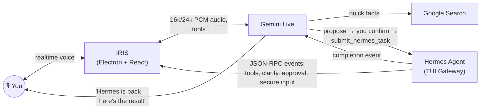
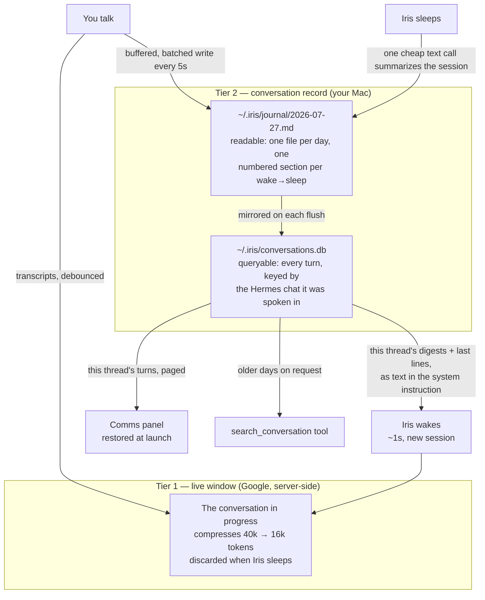

# I.R.I.S

**A JARVIS-style voice companion for your desktop.**
Talk naturally. Delegate real work. Control it with your hands. Let it float over everything you do.

[License: MIT](LICENSE)
[Platform](#-quick-start)
[Built with Electron](#-tech-stack)
[PRs Welcome](#-contributing)
[Follow on X](https://x.com/ai_for_success)

**Gemini Live** is the voice. **Hermes Agent** is the muscle. Iris is the bridge between you and both.

[Demo](#-demo) · [Features](#-features) · [Glass HUD](#-glass-hud-mode) · [Quick Start](#-quick-start) · [How It Works](#-how-it-works)


---


## 🎬 Demo

> 🔊 **Sound on — Iris is a voice tool.** A real session: waking Iris by voice, delegating a task to Hermes mid-conversation, live tool steps streaming in, opening the result hands-free with a finger point, and Glass HUD mode over the desktop.

[https://github.com/user-attachments/assets/735eb3eb-d98e-4e45-913c-66105ae076b1](https://github.com/user-attachments/assets/735eb3eb-d98e-4e45-913c-66105ae076b1)

---


## ✨ What is Iris?

Iris is a **voice-first desktop companion** built on a two-brain architecture:

- 🎙️ **Gemini Live** handles realtime conversation — you speak, it answers instantly with natural voice, handles interruptions (talk over it, it stops), and uses built-in Google Search for quick facts.
- 🛠️ **[Hermes Agent](https://github.com/NousResearch)** does the real work — research, coding, files, terminal, browser automation, email, Notion, anything tool-heavy. Iris hands tasks to Hermes **in the background** and keeps chatting with you while Hermes grinds.
- 🖐️ **MediaPipe hand tracking** lets you drive the whole UI in the air — point-and-hold to click anything, open palm to scroll, fist to close. Fully on-device.
- 🪟 **Glass HUD mode** turns Iris into a transparent, click-through overlay floating above your entire screen — keep coding, browsing, writing, while Iris hovers like a heads-up display.

When Hermes finishes a background task, Iris **proactively speaks up**: *"Quick update — Hermes is back with the result."* That's the loop: you talk, Iris routes, Hermes works, Iris reports back.

---


## 🚀 Features


### Voice & conversation

- **Realtime voice** via Gemini Live (16 kHz in / 24 kHz out, WebRTC echo cancellation — works fine on laptop speakers)
- **"Hey Iris" wake word** — local, on-device ONNX inference; nothing leaves your machine while asleep
- **Barge-in** — interrupt Iris mid-sentence and it yields immediately
- **Speech-aware standby** — local Silero VAD protects long utterances from the idle timer without using room-volume thresholds; Gemini retains its own automatic VAD for conversation turns
- **Voice-driven UI** — "open the latest result", "show the steps", "open the failed one", "close it" — fuzzy-matched against what's on screen
- **Shared personal context** — a bounded snapshot of Hermes `USER.md` and `MEMORY.md` keeps ordinary conversation coherent; brain notes and deeper memory details remain available through sourced retrieval tools


### The Hermes work loop

- **Background delegation** — tasks return a `run_id` instantly; conversation never blocks
- **Live activity feed** — every tool call Hermes makes (browser, code, files, search) streams into the task card in real time with durations
- **Full Hermes interaction bridge** — native clarification choices/free text, dangerous-command approvals, sudo passwords, and secret prompts surface in Iris. Sensitive values stay UI-only and never enter Gemini.
- **Visible voice answers** — spoken clarification text fills the on-screen field/choice briefly before Iris submits it to Hermes
- **Proactive completion announcements** — Iris tells you the moment work finishes and summarizes it out loud
- **Intent-aware confirmation gate** — Iris reads back an immutable proposal and interprets your next response conversationally, with no required approval phrase. Code still enforces a separate user turn, proposal ID, exact brief, selected Hermes thread, and TTL before dispatch.
- **Anti-hallucination guardrails** — status and results can only come from real Hermes API responses; "still working" is the only honest answer until then, and tool responses say so explicitly


### Sessions & memory

- **Conversation memory across the whole day** — a live session only holds the last few minutes of speech, so every conversation is saved to `~/.iris/journal/YYYY-MM-DD.md` on your machine: one file per day headed with the weekday, one numbered section per session with the times it ran, each summarized in a couple of lines. Iris reads today's summaries when it wakes, so "what did we decide this morning?" just works — and searches older days on request
- **`search_conversation` for older days** — "the thing I mentioned yesterday", "what did we talk about last week"; keyword search over summaries, ~0.06 ms per query with no network round trip
- **Bounded context window** — compression keeps long sessions affordable and lifts Google's 15-minute audio-session ceiling, without starving Google Search of the room it needs for grounded results
- **One pinned Hermes chat thread** — like picking a chat in the Hermes app; no stray sessions
- **Session switcher on the main page** — chip at the top of the Work Stream lists your Iris sessions; **+** starts a new thread (named by Hermes, titled by your first prompt, like every chat tool)
- **Session-scoped Work Stream** — only the selected session’s cards are shown; work in other sessions continues without leaking cards into the current thread
- **History restore** — close Iris, reopen it, and your past completed runs are rebuilt from Hermes's own session transcript. Nothing is lost between launches.
- **Standby that survives the day** — Iris naps after silence and wakes in about a second regardless of how long you have been talking, because waking opens a new session carrying the conversation as memory rather than replaying it


### Hands-free control

- **Point-and-hold to click anything** (~0.3 s) — cards, buttons, toggles, chips; the reticle visibly "charges" while arming
- **Open palm** — joystick scrolling over whatever region your hand hovers: work stream, comms, step timelines, the reader
- **Two open palms** — resize the reader
- **Closed fist** — close the reader
- All tracking is **on-device** (MediaPipe GestureRecognizer); frames never leave your machine


### Design

- **Deep-space design system** — electric cyan + violet on flat deep navy (deliberately *not* near-black — see [below](#dark-ui-without-colour-banding)), glass panels, Inter / Space Grotesk / JetBrains Mono
- **The orb** — a canvas-drawn arc reactor that breathes with the actual audio level, changes palette per state (listening / speaking / working), and flashes when work is handed off
- **Orb micro-expressions** — a double-pulse on wake, a soft ripple when your words are locked in, and an orbiting "thinking" swirl in the gap before Iris speaks
- **Two voice signatures** — your voice renders as sharp radial bars around the orb; Iris's voice as a smooth breathing wave. You can *see* who's talking.
- **Sound design** — five subtle synthesized cues (wake, sleep, task sent, task done, approval needed). No audio files; pure tuned Web Audio tones. Toggle in Settings.
- **Comet handoff** — a particle streaks from the orb to the task card when Gemini delegates, and back when Hermes returns
- **Cinematic boot sequence**, animated transitions, and a custom app icon rendered from the orb itself

### Dark UI without colour banding

If you have ever built a dark interface and seen faint **contour lines** — concentric
rings or horizontal bands across large dark areas — this section is why Iris does
not have them. It is the most transferable thing in this design system, so it is
written up in full.

**The cause.** A display gives you 256 steps per channel, and sRGB spends very few
of them near black. A soft gradient stretched across 900px has only a handful of
values available to cross that distance, so it cannot render as a gradient at all:
it becomes a few wide flat plateaus with a hard 1-level edge between each. Those
edges are the contour lines. It gets worse the darker you go, because below the
sRGB toe brightness is proportional to code value — **one code step at value 7 is a
~14% jump in brightness; at value 21 the same step is ~5%**, which is under the
threshold where the eye reads it as a line.

This is not a bug anyone has fixed. You can see it in Cursor, in native macOS
windows, and in dark video. Polished apps don't solve it — they avoid causing it.
Look closely at Linear, Raycast, Xcode or Things: almost no large soft gradients
anywhere. Flat surfaces, hairlines, small shadows, and gradients only where they
are small and steep.

**The rules Iris follows.**

1. **If a gradient crosses more pixels than it has code levels to cross them with,
   it is not a gradient — it is a stack of plateaus with visible edges.** Make it a
   flat fill. The deck background was two window-sized radial washes plus a
   `--bg-1 → --bg-0` ramp; that ramp spanned **2 levels of green over 860px**.
   Invisible as shading, glaring as edges.
2. **Keep the whole palette out of the crush zone.** `--bg-0` is `#0b111c`, not the
   `#030509` it started as. Everything painted later — vignettes, scrims, overlays —
   has to respect the same floor, or it drags its own region back down.
3. **Gradients on dark surfaces must be small and steep.** A 40px button fade has
   plenty of levels for its range. A 900px wash does not.
4. **Depth comes from a step of fill tone plus spacing**, not from washes or
   outlines. Surfaces here nest by tone: background → panel → card. None of them
   carry a border, because a surface a step lighter than its parent already reads as
   separate, and saying it twice means the lines are what you notice.
5. **One light source, and let it be real.** The reactor canvas is the only thing
   that glows. Beware the trap: once the background is flat, a single soft halo
   becomes the *only* brightness variation, so a bright centre falling off to dark
   corners is exactly what vignetting looks like.

**What does not work**, in case you are tempted:

- **A noise/dither overlay.** The standard advice, and it is a band-aid. It cannot
  remove a staircase that is already baked into a rasterized layer — it only
  textures over it, so the low-frequency steps the eye integrates survive. Worse,
  `backdrop-filter` **averages** its backdrop, so any dither underneath a blurred
  glass panel is smoothed away and the banding comes back inside the glass.
- **Blend modes.** `mix-blend-mode: overlay` resolves to `2 × backdrop × source`
  below mid-grey, so on a near-black surface its effect is a fraction of one code
  level. Invisible.
- **More gradient stops.** The steps are a quantization limit, not a stop-count
  problem.

**If you need to measure it.** Run-length checks will lie to you: dither makes runs
look short while the banding is untouched. The eye integrates *along* a long
straight edge, so average each row across a wide strip of background first (which
cancels per-pixel noise), then look for jumps in that row-average. Max local slope
is the number that tracks visibility — a smooth 30-level ramp over 600px climbs at
~0.05 levels/px, and anything spiking well above that is a line you can see.

> These rules are enforced for future work, not just documented: they live as a
> Cursor rule in [`.cursor/rules/dark-theme-no-banding.mdc`](.cursor/rules/dark-theme-no-banding.mdc),
> scoped to `src/styles/**/*.css`, so anyone (or any agent) editing the styles gets
> them automatically. Copy that file into another project to carry the approach
> over.

---


## 🪟 Glass HUD mode

The signature feature. Press **⌥H** anywhere (or say *"enter HUD mode"*):


- Iris becomes a **transparent, always-on-top overlay** across your whole screen
- **Click-through everywhere** except Iris's own elements — your mouse works normally in the apps underneath
- Collapsible **Tasks** and **Comms** chips, camera tile, caption pill by the orb
- Open results in a glass reader **without blacking out your desktop**
- Gestures get even better here: your hand reticle floats over your entire screen
- Menu-bar tray icon keeps Iris alive in the background (wake/sleep/HUD from the tray)


---


## ⚡ Quick Start


### Prerequisites

- **Node.js 20+** and npm
- **[Hermes Agent](https://github.com/NousResearch)** installed with the gateway running
- A free **Gemini API key** from [Google AI Studio](https://aistudio.google.com/apikey)
- macOS, Windows, or Linux (Glass HUD is built and tuned on macOS)


### 1 — Install & run

```bash
git clone https://github.com/ASHR12/iris.git
cd iris
npm install
npm run dev
```


### 2 — Enable the Hermes API

```bash
echo 'API_SERVER_ENABLED=true' >> ~/.hermes/.env
echo "API_SERVER_KEY=$(openssl rand -hex 32)" >> ~/.hermes/.env
hermes gateway restart
```

> Hermes requires a strong key (16+ chars) and refuses to start its API server
> with a short or placeholder one — this endpoint dispatches terminal-capable
> agent work. Use the same key in Iris's `~/.iris/.env`.


### 3 — Complete the setup wizard

Iris opens an **onboarding wizard** on first launch — paste your Gemini key (with a live **Test** button), point it at Hermes (**Test** that too), pick a voice (with preview), grant mic permission. Everything saves to `~/.iris/.env`. **No manual file editing needed.**

### 4 — Wake it up

Press **⌥W** (or say **"Hey Iris"** if you enabled the wake word). Ask it something. Then ask it to *do* something — "check my unread emails and summarize what needs attention" — confirm the brief, and watch Hermes go to work while you keep talking.

> **Try it with zero keys:** toggle **demo mode** in Settings → Advanced. `D` loads a full fake workspace, `G` plays a simulated handoff. Great for screenshots and poking at the UI.

**Production build & packaging**

```bash
npm start            # build + launch production bundle
npm run package:mac  # macOS .app; uses IRIS_MAC_SIGNING_IDENTITY or "Local Development" when available
npm run install:mac  # build + install to /Applications + launch (macOS)
npm run dist:win     # Windows distributable
```

Local macOS packaging post-signs and verifies the bundle with the configured identity. If that certificate is unavailable, packaging falls back to an unsigned local build.

The packaged app reads config from `~/.iris/.env` (`%USERPROFILE%\.iris\.env` on Windows), written by the wizard.


---


## 🎮 Controls


| Input             | Action                                                                             |
| ----------------- | ---------------------------------------------------------------------------------- |
| **⌥W** / **⌥S**   | Wake / sleep (global — works from any app, even with the HUD over your work)       |
| **⌥H**            | Toggle Glass HUD (global — works from any app; configurable via `IRIS_HUD_HOTKEY`) |
| **"Hey Iris"**    | Wake by voice (opt-in, on-device)                                                  |
| Top-right buttons | HUD toggle · Settings · hand-tracking toggle · link status                         |
| Menu-bar icon     | Wake/sleep, HUD, show deck, quit                                                   |
| **D** / **G**     | Load demo data / simulate a handoff (demo mode only)                               |


### Hand gestures


| Gesture             | Action                                                                   |
| ------------------- | ------------------------------------------------------------------------ |
| ☝️ Point (index up) | Move the cursor — **hold ~0.3 s over anything clickable to click it**    |
| ✋ Open palm         | Hold-to-scroll whatever region your hand is over (high = up, low = down) |
| 🙌 Two open palms   | Resize the open reader                                                   |
| ✊ Closed fist       | Close the reader                                                         |


### Say things like

- *"What's the latest on the OpenAI news?"* → answered directly with Google Search
- *"Check my unread emails and tell me if anything needs attention"* → read-back → your natural confirmation → Hermes runs it in the background
- *"How's that task going?"* → real status from the Hermes API, never invented
- *"Open the latest result"* / *"show the steps"* / *"open the failed one"* → UI obeys

---


## 🧠 How it works


```mermaid
flowchart LR
  You(("🎙️ You")) <-->|"realtime voice"| Iris["IRIS<br/>(Electron + React)"]
  Iris <-->|"16k/24k PCM audio,<br/>tools"| Gemini["Gemini Live"]
  Gemini -->|"quick facts"| Search["Google Search"]
  Gemini -->|"propose → you confirm →<br/>submit_hermes_task"| Hermes["Hermes Agent<br/>(TUI Gateway)"]
  Hermes -->|"JSON-RPC events:<br/>tools, clarify, approval, secure input"| Iris
  Hermes -->|"completion event"| Gemini
  Gemini -->|"'Hermes is back —<br/>here's the result'"| You
```


1. **Electron main owns the Gemini Live session** — mic audio streams up, voice streams back, transcripts and state events flow to the UI.
2. **Gemini routes**: quick public facts use Google Search, personal recall uses sourced `search_memory` / `read_memory_note`, UI commands stay local, and real work goes through the immutable **two-step dispatch gate**.
3. **Hermes runs in the background** through its authenticated TUI Gateway WebSocket. Tasks in one chat queue safely; different chats may work concurrently. Every tool step and native interaction request streams into Iris.
4. **On completion**, Iris injects a system event into Gemini so it proactively announces and summarizes the result — then you can open it by voice, mouse, or finger.
5. **Sessions mirror Hermes**: all work lives in one pinned Hermes chat thread; the Work Stream rebuilds from that thread's transcript on every launch.
6. **Memory is two-tier** — a short, compressed live window for the conversation you are having, and a local journal for the rest of the day. See below.

### Memory across a long day

A Live session is not a place to keep memory. The API re-bills the entire context on every turn, native audio accrues roughly 25 tokens per second even in silence, and audio-only sessions are capped at 15 minutes unless the window is compressed. So Iris deliberately keeps the live window short and stores what matters on disk instead — the same split Google's Agent Development Kit draws between short-term session state and a long-term memory service, done locally.


```mermaid
flowchart TB
  subgraph live["Tier 1 — live window (Google, server-side)"]
    W["The conversation in progress<br/>compresses 40k → 16k tokens<br/>discarded when Iris sleeps"]
  end
  subgraph disk["Tier 2 — conversation record (your Mac)"]
    F["~/.iris/journal/2026-07-27.md<br/>readable: one file per day, one<br/>numbered section per wake→sleep"]
    D["~/.iris/conversations.db<br/>queryable: every turn, keyed by<br/>the Hermes chat it was spoken in"]
  end
  Talk["You talk"] -->|"transcripts, debounced"| W
  Talk -->|"buffered, batched write every 5s"| F
  F -->|"mirrored on each flush"| D
  Sleep["Iris sleeps"] -->|"one cheap text call summarizes the session"| F
  D -->|"this thread's digests + last lines,<br/>as text in the system instruction"| Wake["Iris wakes<br/>~1s, new session"]
  Wake --> W
  D -->|"this thread's turns, paged"| Panel["Comms panel<br/>restored at launch"]
  D -->|"older days on request"| Tool["search_conversation tool"]
```

A day on disk, which is meant to be readable months later without tooling — file names stay `YYYY-MM-DD.md` because retention sorts them as strings, but everything inside is written for a person:

```markdown
# Conversation journal — Monday, 27 July 2026

Every conversation held on Monday, 27 July 2026, oldest first — one section per session,
from the moment Iris woke to the moment she slept, summarised under its heading.

## Session 1 — 09:12–09:31 (id: 20260727-091200-ggg8)
**Digest:** You asked me to pull the April deal numbers and I dispatched that to Hermes.
- 09:12 you: ask Hermes for the April deal numbers
- 09:12 iris: Hermes has started the task.

## Session 2 — 15:02–15:08 (id: 20260727-150200-piz5)
**Digest:** I confirmed the finance summary row came from your Notion workspace.
- 15:02 you: where did that finance summary come from?
```

- **A conversation is identified by its Hermes chat**, which is what makes the two halves of the screen one thing. The Work Stream restores its task cards from Hermes by that id; the Comms panel restores its turns from the local index by the same id. Close the app mid-thought and reopen it tomorrow and both come back together. Picking another chat switches both, and re-scopes what Iris remembers too — otherwise she would answer one project out of another's context. A chat nobody has spoken in shows nothing rather than borrowing another's conversation.
- **Two files, one write path.** The Markdown is the artifact you own and can grep; the SQLite index is what the app queries, and it is fed from the journal's own flush rather than written separately, so the two cannot disagree about where a session starts and ends. `node:sqlite` ships inside Electron, so this adds no native dependency and nothing to rebuild at package time.
- **Waking never replays the conversation.** Handing the session back to Google to rehydrate costs about 140ms per turn of history — 1.0s fresh, 3.5s at 10 turns, 6.4s at 30, 9.6s at 60 — so every wake got slower than the last one all day. Connecting costs ~90ms either way, so a wake now opens a new session and carries the conversation across as text. Resumption handles survive only to recover a socket that drops mid-sentence, where the context is already warm.
- **Writes never touch the audio path.** Turns are buffered in memory and flushed on a timer; the summary call happens after the socket closes, so sleeping stays instant.
- **The summary is written in Iris's own voice** ("I reviewed the Vercel bill and asked Hermes to…") because it is injected back as memory, and third-person notes read like someone else's.
- **The journal is on by default**, and it is the only thing carrying a nap. Turned off, waking is just as quick but each session starts knowing nothing of the earlier ones — which is the honest reading of switching memory off.
- **Retention is bounded**: raw spoken lines age out after 7 days, summaries after 90, swept shortly after each launch. A full day of conversation is on the order of a couple of KB.
- `~/.iris/session-log.jsonl` records every wake with its connect time, so a slow one leaves evidence instead of guesswork.

**Pinned models, SDKs & known footguns (for contributors)**


| Purpose           | Identifier                                                                     | Where                                     |
| ----------------- | ------------------------------------------------------------------------------ | ----------------------------------------- |
| Gemini Live model | `models/gemini-3.1-flash-live-preview`                                         | `electron/main.mjs` (`GEMINI_LIVE_MODEL`) |
| Session summaries | `gemini-flash-lite-latest` (one-shot text, off the voice path)                  | `electron/main.mjs` (`IRIS_DIGEST_MODEL`) |
| Gemini SDK        | `@google/genai`                                                                | `package.json`                            |
| Gesture runtime   | `@mediapipe/tasks-vision` (WASM pinned to same version in `useHandControl.ts`) | `package.json`                            |
| Wake word         | openWakeWord-style ONNX via `onnxruntime-web`                                  | `public/wakeword/`                        |


- Live models are a distinct family — a normal `gemini-*` chat model will not open a Live session. Keep the `models/` prefix.
- Gemini Live audio is fixed-format: **send 16 kHz PCM, receive 24 kHz PCM**.
- Live function calls are synchronous — never block a tool call on Hermes work; return the `run_id` immediately.
- **Context compression has a floor.** Tool schemas, the instruction set, and the `USER`/`MEMORY` snapshot total roughly 5.5k tokens and are never pruned by `slidingWindow`. Sizing `targetTokens` too close to that floor leaves no room for a Google Search result to land — an earlier 16384/8192 attempt broke grounded search for exactly this reason, and a 4000/2000 probe fails the request outright. The shipped 40000/16000 was verified live: a forced compression, then a grounded search that still returned a real figure.
- Keep the MediaPipe WASM CDN version identical to the installed npm package version.
- MediaPipe WASM + model are fetched from CDN on first gesture use — first run needs network.


---


## ⚙️ Configuration

Everything is configurable through **Settings (gear icon)** — the file below is written for you. Power users can edit `~/.iris/.env` directly:

```bash
GEMINI_API_KEY=...                                # required — aistudio.google.com/apikey
IRIS_USER_NAME=Ashutosh                           # what Iris calls you
GEMINI_LIVE_MODEL=models/gemini-3.1-flash-live-preview
GEMINI_LIVE_VOICE=Zephyr                          # pick + preview in Settings
HERMES_API_URL=http://127.0.0.1:8642
API_SERVER_KEY=<openssl rand -hex 32>             # 16+ chars, must match Hermes's ~/.hermes/.env
HERMES_HOME=~/.hermes                             # optional, auto-detected
IRIS_HERMES_TRANSPORT=interactive                 # full TUI Gateway protocol; runs_api is legacy fallback
# IRIS_HERMES_CWD=/safe/workspace                 # optional; unset uses Hermes terminal.cwd (recommended)
# IRIS_HERMES_PROTECTED_PATHS=~/Documents,...     # optional protected-path override; Downloads allowed by default
IRIS_HERMES_SESSION=iris-voice                    # pinned Hermes chat (or use the UI switcher)
IRIS_HERMES_MEMORY_KEY=iris:desktop:your-name     # stable long-term memory scope (auto-derived if omitted)
IRIS_WAKE_WORD=true                               # "Hey Iris" on-device wake word
IRIS_WAKE_SENSITIVITY=balanced                    # relaxed 20% / balanced 30% / strict 40%
IRIS_SHOW_WAKE_DIAGNOSTICS=false                  # optional 6-second wake reason/confidence overlay
IRIS_HUD_HOTKEY=Alt+H                             # global Glass HUD hotkey
IRIS_AUTO_SLEEP_SECONDS=30                        # standby after N s of silence (0 = never) — saves ~80% of Live API cost
IRIS_AUTO_WAKE_ON_HERMES=true                     # Hermes results wake Iris from standby to announce themselves
IRIS_CONVERSATION_JOURNAL=true                    # local per-day conversation summaries (~/.iris/journal) — how Iris recalls earlier today
IRIS_JOURNAL_RAW_DAYS=7                           # how long the underlying spoken lines are kept
IRIS_JOURNAL_DIGEST_DAYS=90                       # how long the summaries are kept
IRIS_DIGEST_MODEL=gemini-flash-lite-latest        # one-shot summary model; falls back to plain text if the call fails
IRIS_SESSION_LOG=true                             # ~/.iris/session-log.jsonl connect/resume diagnostics
IRIS_GESTURE_CONTROL=false                        # camera + hand tracking; off until you switch it on
IRIS_SOUNDS=true                                  # subtle interface sound cues
IRIS_LOAD_TEST_DATA=false                         # demo mode
```

To erase conversation memory, delete `~/.iris/journal` and `~/.iris/conversations.db` — or set `IRIS_CONVERSATION_JOURNAL=false` (**Settings → Conversation memory**) to keep no record at all.

Config resolution order: repo `.env` (dev) → `~/.iris/.env` (wizard/packaged) → bundled `.env`.

---


## 📁 Project structure

```
electron/          main process — Gemini Live session, Hermes bridge, dispatch
                   gate, Glass HUD window control, tray, config
                   liveSessionState / liveToolCoordinator — turn lifecycle,
                   resume handles, serialized tool execution
                   conversationJournal / conversationDigest — per-day journal,
                   session summaries, retention
                   conversationStore.mjs — SQLite index over the journal:
                   per-thread restore, paging, recall search
                   sessionLog.mjs — append-only session lifecycle diagnostics
                   hermes* — HTTP/gateway clients, event stream, interactive
                   transport, dispatch gate, result service
                   brainIndex.mjs — embedding + BM25 retrieval stack (also a CLI)
                   runRegistry, memoryService, configStore, rendererBridge,
                   routingPolicy, approvalPolicy, sleepIntent, windowSecurity
src/
  components/      TopBar, CommsPanel, WorkStream, WorkCard, CenterStage,
                   HudShell, BrainGraph, ReaderOverlay, SessionSwitcher,
                   SetupPanel, DevicePicker, HermesInteractionPrompt,
                   ApprovalPrompt, CameraDock, …
  hooks/           useAudioPipeline, useHandControl, useWakeWord, useHandoffFx
  lib/             audio/PCM helpers, task utils + fuzzy matching, sounds, fixtures
  styles/          deep-space design system (tokens → base → deck → overlays → fx
                   → hud → brain)
test/              19 Node test files — gate, Live lifecycle, Hermes contract,
                   registry, memory, journal, routing, security
scripts/           dev launcher, icon renderer, macOS package/install/sign,
                   demo-vault generator, live-API harnesses, soak runner
public/wakeword/   on-device "Hey Iris" ONNX models
public/audio/      PCM capture AudioWorklet
build/             app icon (SVG source + renderer) and tray assets
demo-obsidian-vault/  164 generated fictional notes for demoing the Neural Map
sidecar/           legacy Python Live reference (off unless explicitly enabled)
```

---


## 🛠 Tech stack


| Layer     | Tech                                                                       |
| --------- | -------------------------------------------------------------------------- |
| Shell     | Electron (transparent frameless window, global shortcuts, tray)            |
| UI        | React 19 + TypeScript + Vite, custom CSS design system                     |
| Voice     | Gemini Live API (`@google/genai`), Web Audio (capture, playback, metering) |
| Agent     | Hermes TUI Gateway JSON-RPC/WebSocket + local session API                  |
| Gestures  | MediaPipe Tasks Vision `GestureRecognizer` (GPU, on-device)                |
| Wake word | onnxruntime-web, openWakeWord-style mel → embedding → classifier pipeline  |


---

---

## 🤝 Contributing

PRs and issues are very welcome. Good first areas: new orb themes, additional gesture mappings, Windows/Linux HUD polish, sound design, more voice UI commands.

```bash
npm run dev      # hot-reload dev loop
npm run build    # typecheck + bundle
npm test         # gate, Hermes contract, memory, routing, persistence and security
npm run verify   # tests + Electron checks + build + Python reference compile
npm run test:live-search # real Gemini Search must survive aggressive standby
npm run test:live-sleep  # explicit sleep must resume cleanly into a new turn
npm run test:live-speech # active speech must block standby until speech ends
npm run test:hermes-wake # measure Hermes completion wake and announcement
npm run soak     # 8-hour Electron RSS/heap and wake/HUD lifecycle sampler
```

Please keep the two golden rules: **voice must never regress because of gestures**, and **Iris never invents Hermes results** — status comes from the API or it doesn't exist.

Release history lives in [CHANGELOG.md](CHANGELOG.md).

## ⚠️ Privacy & security notes

Found a vulnerability? Please report it privately — see [SECURITY.md](SECURITY.md). Iris dispatches terminal-capable work to Hermes, so anything that can influence a dispatch is treated as a security issue rather than a UX one.

- Your Gemini key and Hermes key live in mode-`0600` `~/.iris/.env`, are never returned to renderer state, and are never committed.
- Camera frames and wake-word audio are processed **entirely on-device** and never uploaded.
- Conversation audio goes to Gemini Live while Iris is awake. Wake-word audio stays local while asleep, and nothing connects to Google while Iris is napping.
- **Conversations are written to disk.** With `IRIS_CONVERSATION_JOURNAL=true` (the default), spoken transcripts and a short summary per conversation are stored in `~/.iris/journal/YYYY-MM-DD.md` and mirrored into `~/.iris/conversations.db` on your machine only — never uploaded. The only thing sent to Google is the one-shot summarization call at the end of a session. That record is what restores the Comms panel at launch and what the current chat's summaries are seeded from on the next wake. Turn the setting off to keep no record, and delete both to erase what exists.
- A bounded snapshot of Hermes `USER.md` and `MEMORY.md` is sent to Gemini at session setup. Brain-note content is retrieved only when relevant; semantic indexing/querying also uses Gemini embeddings when enabled.
- `API_SERVER_KEY` must be a strong secret (Hermes enforces 16+ chars and refuses weak keys — the endpoint dispatches terminal-capable agent work). Generate one with `openssl rand -hex 32` and use the same value on both sides.


## 📄 License

[MIT](LICENSE) — build wild things with it.

---


Built by **[Ashutosh Shrivastava](http://ashutoshai.com/)** — AI consultant & tech storyteller, 1M+ weekly reach on X

[🌐 Website](http://ashutoshai.com/) · [𝕏 / Twitter](https://x.com/ai_for_success) · [YouTube](https://www.youtube.com/@AIforSuccess) · [LinkedIn](https://www.linkedin.com/in/aiforsuccess/) · [Instagram](https://www.instagram.com/ashutosh.s.ai/) · [Threads](https://www.threads.com/@ashutosh.s.ai) · [GitHub](https://github.com/ASHR12)

Crafted with **Gemini Live**, **Hermes Agent**, and an unreasonable love for arc reactors.

⭐ **If Iris made you grin, star the repo — it genuinely helps.**

